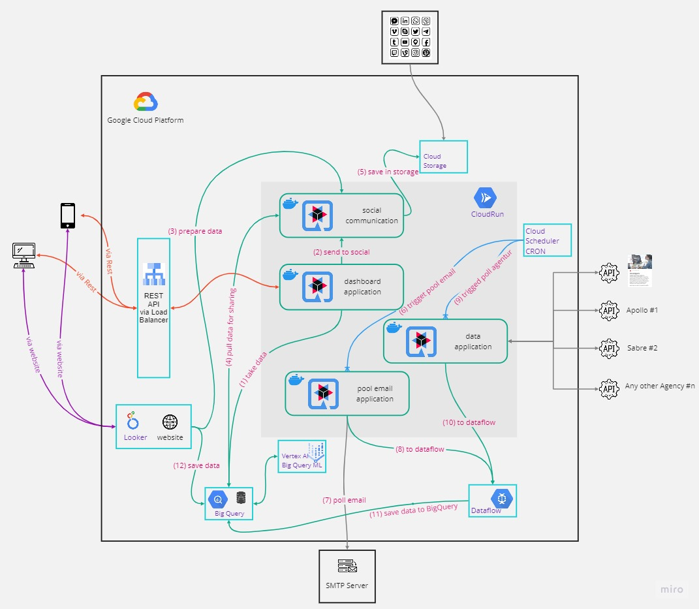
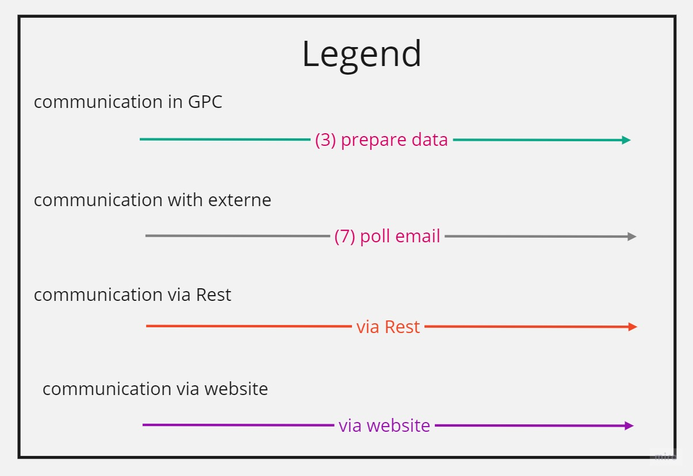

# The Road Warrior System

## Vision

A new startup wants to build the next generation online trip management __dashboard__ to allow __travelers__ to see all of their __existing reservations organized by trip__ either __online (web)__ or through their __mobile device__.

Our vision brainstorming is documented on miro.com:
https://miro.com/app/board/uXjVMmGZNIo=/?share_link_id=176333757297

## Challenge Requirements

- Poll email looking for travel-related email
Filter and whitelist certain emails
- The system must interface with the agency’s existing airline, hotel, and car rental interface system to update travel details (delays, cancellations, updates, gate changes, etc.). Updates must be in the app within 5 minutes of an update (better than the competition)
- Customers should be able to add, update, or delete existing reservations manually as well
- Items in the dashboard should be able to be grouped by trip, and once the trip is complete, the items should automatically be removed from the dashboard.
- Users should also be able to share their trip information by interfacing with standard social media sites or allowing targeted people to view your trip.
- Richest user interface possible across all deployment platforms
- Provide end-of-year summary reports for users with a wide range of metrics about their travel usage
- Road Warrior gathers analytical data from users trips for various purposes - travel trends, locations, airline and hotel vendor preferences, cancellation and update frequency, and so on.
- Users must be able to access the system at all times (max 5 minutes per month of unplanned downtime)
- Travel updates must be presented in the app within 5 minutes of generation by the source
- Response time from web (800ms) and mobile (First-contentful paint of under 1.4 sec)

## Business Requirements

### Short-Term Goals (0-2 years)

- *__Develop MVP (Minimum Viable Product)__* Within the first year, create and launch a basic version of the travel dashboard that offers essential features, such as itinerary planning, real-time flight tracking, and local recommendations.

- *__Feedback and Iteration__* Gather user feedback and data to continuously improve the dashboard's user experience and functionality. Implement regular updates and fixes based on this feedback

### Long-Term Goals (3-5 years and beyond)

- *__Global Expansion__* extend the travel dashboard's reach to cover a wide range of international destinations, making it a comprehensive resource for travelers worldwide

- *__Market Leader Status__* establish the travel dashboard as a market leader in terms of user base and quality of service, becoming the go-to platform for travelers looking to plan their trips.

## The proposed Architecture

We made the decision to build a solution based on [Google Cloud](https://console.cloud.google.com/). 

Our microservice oriented approach is utilizing various GCP services to maintain a good balance between cost and performance, allowing infinite scale while maintaining a scale to 0 option to save cost. The following services are covering the entire solution:
* Cloud Run: Is hosting our container based microservices to cater for data pulling, collection of emails, providing a rest-api and creating social-media ready data.
* Dataflow: Provides Apache Beam pipelines for data cleaning and preparation, is utilized to bring all gathered data in the same format befor it is stored in our data warehouse.
* BiqQuery: Is our data warehouse that allows sql-like querying for up to petabyte scale within Seconds or Minutes.
* Vertex AI / Bigquery ML: Is utilized to find patterns in BigQuery: e.g. last February all flights of a specific airline where delayed, thus we reccomend our users to choose another airline when traveling in February
* Looker Studio: Enterprise grade vizualisation tool with direct connection to bigquery allowing a visual representation of userdata and data inputs to manipulate data in the dataset.
* Load Balancer: Highly available global resource for user oriented routing of requests to guarantee low latency and reduce traffic cost while serving data from the nearest POP.
* Cloud Storage & Cloud CDN: Generic, highly durable, object storage with global scale to serve our generated data to be shared on social media. Also long term archive storage.
* Cloud Scheduler: Is a simple http trigger that allows cron like scheduling of microservices hosted in cloud run to allow them to scale to 0 if their task is done, saving money.

Color legend for picture:

## Custom build microservices developed by Road Warrior

### dashboard application

The dashboard application provides an rest api (orange arrow) to make data, stored in Biq Query consumable. It's a bridge service between Biq Query Data and Users / internal Marketing and Partners.

It also provides an interface to our social application.

### social application

This microservice can be called from service dashboard (via REST API including Apps) or via Website. If the request is produced from website, the request registerd in social microservice (3-prepare data). If the request is produce via REST API the request is send from dashboard application (2-send to social).

Both producers are processing data in this microservice and take the data corresponding data from BigQuery (4-pull data for sharing). This data is modified for sharing and publishing on social networks, this stored as publicly available static content in Cloud storage (5-save in storage).

### pool email application

Pool email application is activated regulary from Cloud Scheduler CRON (6-trigged pool email). It could be for example for every 1 minutes set up. In this case the pool email application pull one fifth of users email. This way we reach that each email will be trigged with period of 5 minutes. The arrow (7-poll email) check the email and get back the relevant emails, the amount of emails to be fetched is based on a timestamp stored on a per user basis to make sure only new emails are polled and checked.

If the data from email are matching our filter criteria the data is pushed to Dataflow, which will create the unified dataset in Big Query. (8-to dataflow)

### data application

This microservice has the similar function as pool email application. In this case the microservice is activated via (9-trigged poll agentur) Cloud Scheduler CRON but with 3 minutes period. This service will sync with all connected agency APIs to fetch latest data. This is build asynchronous. At the end of this process the data is pushed to Dataflow (10-to dataflow) for further preparation to store it in Big Query.
